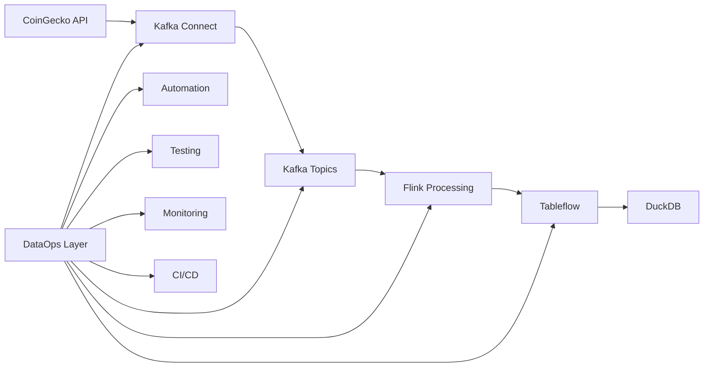

# 📚 Fundamentos de DataOps
**Bloque 1: 15 minutos**

## 🎯 ¿Qué es DataOps?

**DataOps** es una metodología que aplica principios de DevOps al desarrollo y operación de pipelines de datos, enfocándose en:

- **Automatización** de procesos de datos
- **Colaboración** entre equipos de datos
- **Monitoreo continuo** de calidad de datos
- **Entrega rápida** y confiable de insights

## 🔄 DataOps vs DevOps vs MLOps

| Aspecto | DevOps | DataOps | MLOps |
|---------|--------|---------|-------|
| **Foco** | Aplicaciones | Pipelines de datos | Modelos ML |
| **Artefacto** | Código | Datos + Código | Modelos + Datos |
| **Calidad** | Tests unitarios | Tests de datos | Validación de modelos |
| **Monitoreo** | Uptime, latencia | Calidad, frescura | Drift, performance |

## 🏗️ Principios Fundamentales

### 1. **Automatización First**
```bash
# Manual (❌)
confluent kafka topic create crypto-prices
confluent connect cluster create --config-file config.json

# Automatizado (✅)
./setup-pipeline.sh
```

### 2. **Testing de Datos**
```python
# Validación automática
def test_data_freshness(data):
    age = current_time - data['last_updated_at']
    assert age < 300  # < 5 minutos
```

### 3. **Observabilidad**
```python
# Métricas en tiempo real
metrics = {
    'throughput': messages_per_second,
    'error_rate': errors / total_messages,
    'data_quality_score': passed_tests / total_tests
}
```

### 4. **Colaboración**
- **Data Engineers:** Construyen pipelines
- **Data Scientists:** Definen calidad
- **DevOps:** Proveen infraestructura
- **Business:** Definen SLAs

## 🎯 Beneficios en Nuestro Proyecto

### Antes (Sin DataOps)
- ❌ Setup manual de 30+ minutos
- ❌ Problemas de datos detectados tarde
- ❌ Sin visibilidad del pipeline
- ❌ Deployments manuales propensos a errores

### Después (Con DataOps)
- ✅ Setup automatizado en 5 minutos
- ✅ Detección proactiva de problemas
- ✅ Monitoreo en tiempo real
- ✅ CI/CD automatizado

## 📊 Casos de Uso Reales

### 1. **Netflix**
- Pipelines de recomendaciones con DataOps
- Tests automáticos de calidad de datos
- Monitoreo de drift en tiempo real

### 2. **Uber**
- Validación de datos de viajes
- Alertas automáticas por anomalías
- Pipeline de ML con DataOps

### 3. **Airbnb**
- Tests de integridad de datos de reservas
- Monitoreo de métricas de negocio
- Automatización de reportes

## 🛠️ Herramientas del Ecosistema DataOps

### Testing
- **Great Expectations:** Tests de calidad de datos
- **Deequ:** Validación de datos en Spark
- **Custom Tests:** Como nuestro `data-quality-tests.py`

### Monitoreo
- **Datadog:** Métricas de pipelines
- **Prometheus + Grafana:** Observabilidad
- **Custom Monitoring:** Como nuestro `pipeline-monitor.py`

### Orquestación
- **Apache Airflow:** Workflows de datos
- **Prefect:** Orquestación moderna
- **GitHub Actions:** CI/CD para datos

## 🎯 Aplicación en Nuestro Workshop

Vamos a implementar DataOps en nuestro pipeline de criptomonedas:



### Componentes que Implementaremos:
1. **Automatización:** `setup-pipeline.sh`
2. **Testing:** `data-quality-tests.py`
3. **Monitoreo:** `pipeline-monitor.py`
4. **CI/CD:** GitHub Actions workflow

## 💡 Preguntas de Reflexión

1. **¿Qué problemas de datos has enfrentado en proyectos anteriores?**
2. **¿Cómo detectarías actualmente un problema en un pipeline de streaming?**
3. **¿Qué métricas consideras más importantes para un pipeline de criptomonedas?**

---

**Siguiente:** [Diseño de Pipeline DataOps](02-diseño-pipeline.md)