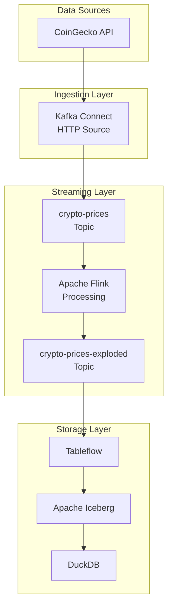
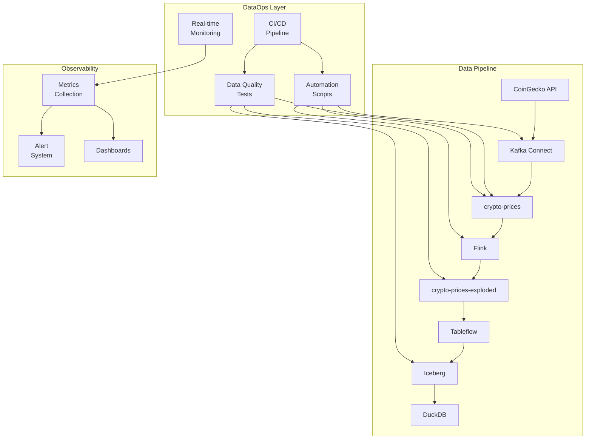

# 🏗️ Diseño de Pipeline DataOps
**Bloque 2: 15 minutos**

## 🎯 Análisis del Pipeline Existente

### Arquitectura Actual


### Puntos de Falla Identificados

| Componente | Riesgo | Impacto | Probabilidad |
|------------|--------|---------|--------------|
| **CoinGecko API** | Rate limiting, downtime | Alto | Medio |
| **Kafka Connect** | Configuración incorrecta | Alto | Bajo |
| **Flink Processing** | Errores de transformación | Medio | Medio |
| **Schema Evolution** | Cambios no compatibles | Alto | Bajo |

## 🛡️ Diseño DataOps

### Arquitectura con DataOps


## 🔍 Puntos de Observabilidad

### 1. **Ingestion Layer**
```python
# Métricas a monitorear
ingestion_metrics = {
    'api_response_time': 'Latencia de CoinGecko API',
    'http_status_codes': 'Códigos de respuesta HTTP',
    'messages_produced': 'Mensajes enviados a Kafka',
    'connector_status': 'Estado del conector'
}
```

### 2. **Streaming Layer**
```python
# Métricas de Kafka y Flink
streaming_metrics = {
    'topic_lag': 'Retraso en tópicos',
    'throughput': 'Mensajes por segundo',
    'processing_latency': 'Latencia de procesamiento',
    'error_rate': 'Tasa de errores'
}
```

### 3. **Data Quality**
```python
# Tests de calidad
quality_tests = {
    'schema_validation': 'Estructura de mensajes',
    'data_freshness': 'Frescura de datos',
    'value_ranges': 'Rangos de precios válidos',
    'completeness': 'Campos completos'
}
```

## 🚨 Sistema de Alertas

### Niveles de Severidad
```python
alert_levels = {
    'CRITICAL': {
        'condition': 'Pipeline completamente caído',
        'response_time': '< 5 minutos',
        'escalation': 'Llamada + SMS'
    },
    'HIGH': {
        'condition': 'Calidad de datos < 80%',
        'response_time': '< 15 minutos', 
        'escalation': 'Email + Slack'
    },
    'MEDIUM': {
        'condition': 'Latencia > 5 minutos',
        'response_time': '< 1 hora',
        'escalation': 'Slack'
    },
    'LOW': {
        'condition': 'Métricas fuera de rango normal',
        'response_time': '< 4 horas',
        'escalation': 'Dashboard'
    }
}
```

### Reglas de Alertas Específicas
```python
# Alertas para nuestro pipeline de criptomonedas
crypto_alerts = {
    'price_anomaly': {
        'condition': 'Bitcoin price < $20k or > $150k',
        'severity': 'HIGH'
    },
    'stale_data': {
        'condition': 'Data age > 10 minutes',
        'severity': 'MEDIUM'
    },
    'processing_lag': {
        'condition': 'Kafka lag > 1000 messages',
        'severity': 'HIGH'
    },
    'api_failure': {
        'condition': 'CoinGecko API errors > 5%',
        'severity': 'CRITICAL'
    }
}
```

## 📊 Métricas Clave (KPIs)

### Métricas de Negocio
- **Data Freshness:** Tiempo desde última actualización
- **Data Completeness:** % de campos completos
- **Data Accuracy:** % de datos dentro de rangos esperados
- **Pipeline Availability:** % de uptime del pipeline

### Métricas Técnicas
- **Throughput:** Mensajes procesados por segundo
- **Latency:** Tiempo end-to-end del pipeline
- **Error Rate:** % de mensajes con errores
- **Resource Utilization:** CPU, memoria, almacenamiento

## 🔄 Flujo de Trabajo DataOps

### 1. **Development**
```bash
# Desarrollador hace cambios
git checkout -b feature/new-crypto-validation
# Modifica data-quality-tests.py
git commit -m "Add Solana price validation"
git push origin feature/new-crypto-validation
```

### 2. **Testing Automático**
```yaml
# GitHub Actions ejecuta automáticamente
- Schema validation
- Data quality tests  
- Infrastructure validation
- Integration tests
```

### 3. **Deployment**
```bash
# Si todos los tests pasan
git merge feature/new-crypto-validation
# Auto-deploy a producción
./dataops/automation/setup-pipeline.sh
```

### 4. **Monitoring**
```python
# Monitoreo continuo post-deployment
monitor.start_monitoring(['crypto-prices', 'crypto-prices-exploded'])
```

## 🎯 Ejercicio Práctico

### Identificar Puntos de Mejora
**Tiempo:** 5 minutos

Analiza el pipeline actual y responde:

1. **¿Qué pasaría si CoinGecko API cambia su esquema de respuesta?**
2. **¿Cómo detectarías si los precios están "congelados" (sin cambios)?**
3. **¿Qué métricas agregarías para monitorear la salud del pipeline?**

### Diseñar Alertas
**Tiempo:** 5 minutos

Diseña 3 alertas específicas para:
- Anomalías en precios de Ethereum
- Problemas de conectividad con la API
- Degradación en la calidad de datos

---

**Siguiente:** [Implementación Práctica](03-implementacion.md)