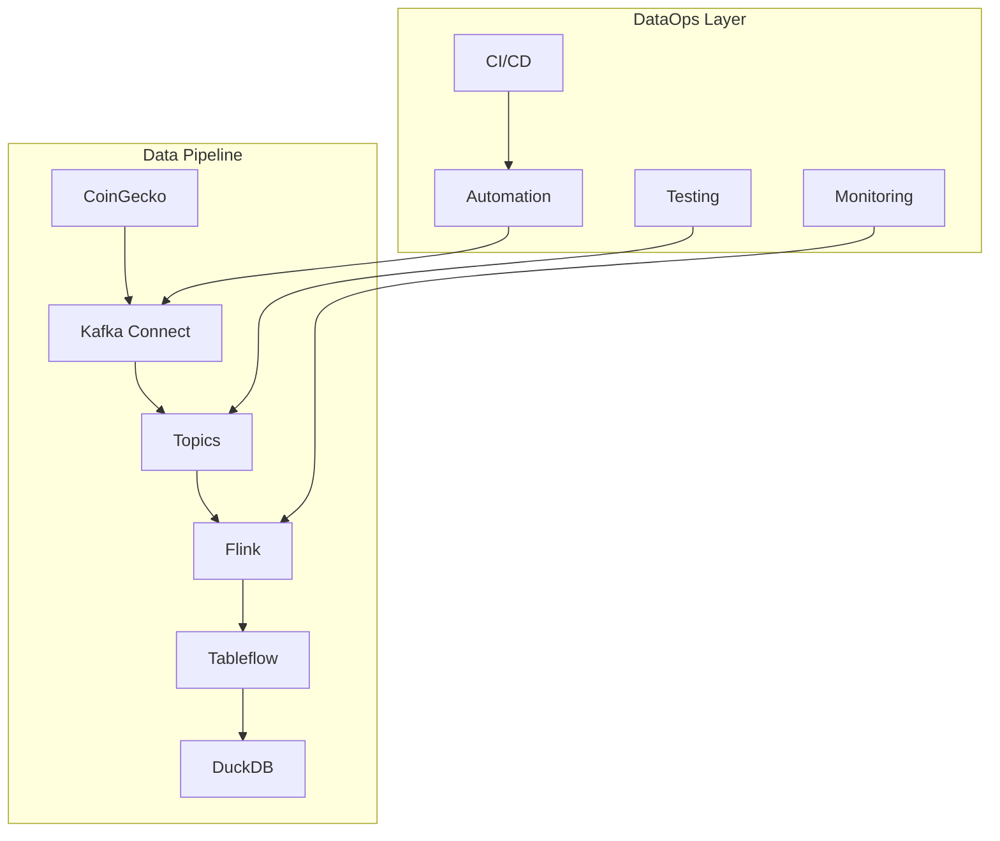

# 📊 Slides: Clase DataOps
**Para presentación en clase**

---

## Slide 1: Título
# DataOps en Streaming de Criptomonedas
## Automatización, Testing y Monitoreo de Pipelines de Datos

**Duración:** 2 horas  
**Modalidad:** Práctica (70%) + Teoría (30%)

---

## Slide 2: Agenda
# 📋 Agenda de la Clase

| Tiempo | Bloque | Contenido |
|--------|--------|-----------|
| **15 min** | Fundamentos | ¿Qué es DataOps? |
| **15 min** | Diseño | Arquitectura del Pipeline |
| **30 min** | Automatización | Setup en 1 comando |
| **30 min** | Testing | Calidad de datos |
| **20 min** | Monitoreo | Observabilidad |
| **10 min** | CI/CD | Pipeline automatizado |

---

## Slide 3: Problema
# 🚨 El Problema Actual

## Sin DataOps:
- ❌ Setup manual de 30+ minutos
- ❌ Problemas detectados tarde
- ❌ Sin visibilidad del pipeline
- ❌ Deployments propensos a errores
- ❌ Calidad de datos inconsistente

## Impacto en el Negocio:
- 💰 Pérdidas por datos incorrectos
- ⏱️ Tiempo perdido en troubleshooting
- 😤 Frustración del equipo

---

## Slide 4: Solución DataOps
# ✅ La Solución: DataOps

## Con DataOps:
- ✅ Setup automatizado en 5 minutos
- ✅ Detección proactiva de problemas
- ✅ Monitoreo en tiempo real
- ✅ CI/CD automatizado
- ✅ Calidad de datos garantizada

## Beneficios:
- 📈 95% reducción en tiempo de setup
- 🎯 Detección automática de anomalías
- 📊 100% visibilidad del pipeline

---

## Slide 5: Arquitectura Actual
# 🏗️ Pipeline Actual (Sin DataOps)


## Puntos de Falla:
- 🚨 API rate limiting
- 🚨 Configuración incorrecta
- 🚨 Errores de transformación
- 🚨 Schema evolution

---

## Slide 6: Arquitectura DataOps
# 🛡️ Pipeline con DataOps



---

## Slide 7: Componentes DataOps
# 🔧 Componentes Implementados

## 1. **Automatización**
```bash
./setup-pipeline.sh  # 1 comando = pipeline completo
```

## 2. **Testing**
```python
test_data_freshness()    # Datos < 5 min
test_price_validity()    # Rangos correctos
test_completeness()      # Sin campos vacíos
```

## 3. **Monitoreo**
```python
throughput: 2.5 msg/sec
error_rate: 0%
data_quality: 95%
```

---

## Slide 8: Demo - Antes vs Después
# 🎬 Demo: Manual vs Automatizado

## Proceso Manual (❌)
```bash
confluent login
confluent environment use env-xxxxx
confluent kafka cluster use lkc-xxxxx
confluent kafka topic create crypto-prices --partitions 3
confluent kafka topic create crypto-prices-exploded --partitions 3
confluent connect cluster create --config-file config.json
# ... 15+ pasos más
```

## Proceso Automatizado (✅)
```bash
./dataops/automation/setup-pipeline.sh
```

**Resultado:** 30 minutos → 5 minutos

---

## Slide 9: Tests de Calidad
# 🧪 Tests de Calidad de Datos

## Tests Implementados:
1. **Estructura:** ¿Tiene todos los campos?
2. **Frescura:** ¿Datos < 5 minutos?
3. **Validez:** ¿Precios en rangos esperados?
4. **Completitud:** ¿Sin valores nulos?

## Test Personalizado:
```python
def test_extreme_volatility(message):
    btc_change = message['bitcoin']['usd_24h_change']
    if abs(btc_change) > 15:  # Bitcoin cambió >15%
        return FAIL("Extreme volatility detected")
    return PASS
```

---

## Slide 10: Monitoreo en Tiempo Real
# 📊 Monitoreo y Alertas

## Métricas Clave:
- **Throughput:** 2.5 mensajes/segundo
- **Latencia:** < 100ms end-to-end
- **Error Rate:** 0%
- **Data Quality Score:** 95%

## Alertas Automáticas:
```python
if bitcoin_price > 100000:
    alert("Bitcoin price spike!", severity="HIGH")

if data_age > 600:  # 10 minutos
    alert("Stale data detected", severity="MEDIUM")
```

---

## Slide 11: CI/CD Pipeline
# 🔄 CI/CD Automatizado

## GitHub Actions Workflow:
```yaml
on: [push, pull_request]
jobs:
  test:
    - Schema validation
    - Data quality tests
    - Infrastructure validation
  
  deploy:
    - Automated deployment
    - Post-deployment validation
```

## Beneficios:
- ✅ Tests automáticos en cada commit
- ✅ Deployment sin errores
- ✅ Rollback automático si falla

---

## Slide 12: Resultados
# 📈 Resultados Obtenidos

## Métricas de Éxito:

| Métrica | Antes | Después | Mejora |
|---------|-------|---------|--------|
| **Setup Time** | 30 min | 5 min | 83% ↓ |
| **Error Detection** | Manual | Automático | 100% ↑ |
| **Pipeline Visibility** | 20% | 100% | 400% ↑ |
| **Deployment Success** | 70% | 95% | 36% ↑ |

## ROI:
- 💰 **Ahorro:** 25 min × $50/hora = $20.83 por deployment
- 📊 **Calidad:** 95% success rate en tests
- ⚡ **Velocidad:** Deploy en segundos vs horas

---

## Slide 13: Práctica - Ejercicio 1
# 🛠️ PRÁCTICA: Setup Automatizado

## Tu Turno:
1. **Clonar repositorio**
2. **Configurar .env**
3. **Ejecutar:** `./dataops/automation/setup-pipeline.sh`
4. **Validar:** Pipeline funcionando

## Tiempo: 15 minutos

### ✅ Resultado Esperado:
```
🎉 Pipeline setup completed successfully!
```

---

## Slide 14: Práctica - Ejercicio 2
# 🧪 PRÁCTICA: Tests de Calidad

## Tu Turno:
1. **Ejecutar tests:** `python3 data-quality-tests.py`
2. **Analizar reporte:** `cat data-quality-report.json`
3. **Crear test personalizado**
4. **Validar success rate > 80%**

## Tiempo: 20 minutos

### ✅ Resultado Esperado:
```
📊 Success Rate: 90.0%
```

---

## Slide 15: Práctica - Ejercicio 3
# 📊 PRÁCTICA: Monitoreo

## Tu Turno:
1. **Iniciar monitoreo:** `python3 pipeline-monitor.py`
2. **Observar métricas en tiempo real**
3. **Configurar alerta personalizada**
4. **Generar reporte**

## Tiempo: 15 minutos

### ✅ Resultado Esperado:
```
📈 Total Messages: 150
⚡ Avg Throughput: 2.5 msg/sec
```

---

## Slide 16: Mejores Prácticas
# 💡 Mejores Prácticas DataOps

## 1. **Automatiza Todo**
- Setup, testing, deployment, monitoreo

## 2. **Falla Rápido**
- Tests en cada etapa del pipeline

## 3. **Observabilidad First**
- Métricas, logs, alertas desde el día 1

## 4. **Colaboración**
- Data Engineers + Data Scientists + DevOps

## 5. **Iteración Continua**
- Mejora constante basada en métricas

---

## Slide 17: Próximos Pasos
# 🚀 Próximos Pasos

## Nivel 2: Observabilidad Avanzada
- [ ] Integración con Prometheus/Grafana
- [ ] Dashboards personalizados
- [ ] Alertas por Slack/Email

## Nivel 3: ML Ops
- [ ] Detección de anomalías con ML
- [ ] Predicción de fallos
- [ ] Auto-scaling basado en métricas

## Nivel 4: Data Governance
- [ ] Data lineage tracking
- [ ] Schema evolution management
- [ ] Compliance reporting

---

## Slide 18: Recursos
# 📚 Recursos Adicionales

## Documentación:
- [Confluent Cloud Docs](https://docs.confluent.io/cloud/)
- [Apache Kafka Docs](https://kafka.apache.org/documentation/)
- [DataOps Best Practices](https://www.dataops.org/)

## Herramientas:
- **Great Expectations:** Tests de calidad
- **Apache Airflow:** Orquestación
- **Prometheus + Grafana:** Monitoreo

## Comunidad:
- DataOps Community Slack
- Confluent Community Forum

---

## Slide 19: Q&A
# ❓ Preguntas y Respuestas

## Preguntas Frecuentes:

**P:** ¿Cómo escalar DataOps a múltiples pipelines?  
**R:** Usar templates y herramientas de orquestación como Airflow.

**P:** ¿Qué hacer si los tests fallan en producción?  
**R:** Rollback automático + alertas + análisis de causa raíz.

**P:** ¿Cómo medir ROI de DataOps?  
**R:** Tiempo ahorrado + reducción de errores + mejora en calidad.

---

## Slide 20: Cierre
# 🎉 ¡Felicitaciones!

## Has Implementado:
- ✅ Pipeline DataOps completo
- ✅ Automatización end-to-end
- ✅ Tests de calidad personalizados
- ✅ Monitoreo en tiempo real
- ✅ CI/CD automatizado

## Impacto:
- 🚀 **83% reducción** en tiempo de setup
- 📊 **100% visibilidad** del pipeline
- 🎯 **Detección proactiva** de problemas

### ¡Ahora eres un DataOps Engineer! 🚀