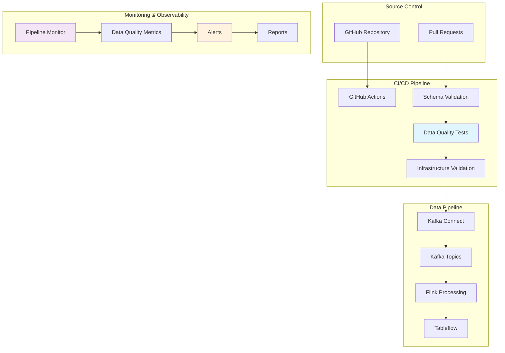

# DataOps Implementation Guide

## 🎯 Objetivo

Esta guía implementa prácticas de DataOps en el workshop de streaming de criptomonedas, automatizando la gestión, testing y monitoreo del pipeline de datos.

## 🏗️ Arquitectura DataOps



## 🚀 Componentes Implementados

### 1. Automatización (`automation/`)

**`setup-pipeline.sh`**
- Setup completo automatizado del pipeline
- Validación de prerequisitos
- Creación de tópicos
- Deployment de conectores
- Validación end-to-end

### 2. Testing (`tests/`)

**`data-quality-tests.py`**
- Tests de estructura de mensajes
- Validación de frescura de datos
- Verificación de rangos de precios
- Tests de completitud de datos

**Tests implementados:**
- ✅ Estructura del mensaje (campos requeridos)
- ✅ Frescura de datos (< 5 minutos)
- ✅ Validez de precios (rangos esperados)
- ✅ Completitud de datos (sin valores nulos)

### 3. Monitoreo (`monitoring/`)

**`pipeline-monitor.py`**
- Monitoreo en tiempo real
- Métricas de throughput
- Detección de anomalías
- Alertas automáticas

**Métricas monitoreadas:**
- 📊 Throughput (mensajes/segundo)
- 📏 Tamaño promedio de mensajes
- ⚠️ Conteo de errores
- 🕐 Lag de consumidores

### 4. CI/CD (`ci-cd/`)

**`github-actions.yml`**
- Pipeline automatizado de CI/CD
- Validación de esquemas Avro
- Tests de calidad de datos
- Deployment automatizado

**Jobs implementados:**
- 🔍 Schema Validation
- 🧪 Data Quality Tests
- 🏗️ Infrastructure Validation
- 📊 Monitoring Setup
- 🚀 Deployment
- 📢 Notifications

## 📋 Guía de Uso

### Setup Inicial

```bash
# 1. Clonar el repositorio
git clone <repository-url>
cd UTEC-streaming-workshop

# 2. Configurar variables de entorno
cp scripts/kafka/.env.example scripts/kafka/.env
# Editar .env con tus credenciales

# 3. Ejecutar setup automatizado
chmod +x dataops/automation/setup-pipeline.sh
./dataops/automation/setup-pipeline.sh
```

### Ejecutar Tests de Calidad

```bash
# Tests manuales
chmod +x dataops/tests/run-data-quality-tests.sh
./dataops/tests/run-data-quality-tests.sh

# Ver reporte
cat dataops/tests/data-quality-report.json
```

### Iniciar Monitoreo

```bash
# Monitoreo en tiempo real
cd dataops/monitoring
python3 pipeline-monitor.py

# Ver logs
tail -f pipeline-monitor.log
```

### CI/CD Setup

```bash
# 1. Copiar workflow a .github/workflows/
mkdir -p .github/workflows
cp dataops/ci-cd/github-actions.yml .github/workflows/

# 2. Configurar secrets en GitHub:
# - KAFKA_BOOTSTRAP_SERVERS
# - KAFKA_API_KEY  
# - KAFKA_API_SECRET

# 3. Push para activar pipeline
git add .
git commit -m "Add DataOps implementation"
git push origin main
```

## 🔧 Configuración Avanzada

### Personalizar Tests de Calidad

Editar `dataops/tests/data-quality-tests.py`:

```python
# Agregar nuevo test
def test_custom_validation(self, message: Dict[str, Any]) -> DataQualityResult:
    # Tu lógica de validación personalizada
    pass
```

### Configurar Alertas

Editar `dataops/monitoring/pipeline-monitor.py`:

```python
# Personalizar umbrales de alertas
def check_data_quality_alerts(self):
    # Tus reglas de alertas personalizadas
    pass
```

### Extender CI/CD

Agregar jobs en `dataops/ci-cd/github-actions.yml`:

```yaml
custom-validation:
  runs-on: ubuntu-latest
  steps:
    - name: Custom Validation
      run: |
        # Tu validación personalizada
```

## 📊 Métricas y KPIs

### Data Quality KPIs
- **Success Rate**: % de tests que pasan
- **Data Freshness**: Tiempo desde última actualización
- **Completeness**: % de campos completos
- **Validity**: % de datos dentro de rangos esperados

### Pipeline KPIs
- **Throughput**: Mensajes procesados por segundo
- **Latency**: Tiempo de procesamiento end-to-end
- **Error Rate**: % de mensajes con errores
- **Availability**: % de uptime del pipeline

### Monitoring KPIs
- **Alert Response Time**: Tiempo hasta detección de problemas
- **MTTR**: Tiempo promedio de recuperación
- **SLA Compliance**: % de cumplimiento de SLAs

## 🚨 Troubleshooting

### Tests de Calidad Fallan

```bash
# Verificar conectividad
curl -s "https://api.coingecko.com/api/v3/simple/price?ids=bitcoin&vs_currencies=usd"

# Verificar configuración Kafka
confluent kafka topic list

# Revisar logs
tail -f dataops/tests/data-quality-report.json
```

### Monitoreo No Funciona

```bash
# Verificar dependencias
pip3 install confluent-kafka

# Verificar variables de entorno
echo $KAFKA_BOOTSTRAP_SERVERS

# Revisar logs de monitoreo
tail -f dataops/monitoring/pipeline-monitor.log
```

### CI/CD Pipeline Falla

```bash
# Verificar secrets en GitHub
# Settings > Secrets and variables > Actions

# Verificar sintaxis YAML
yamllint .github/workflows/github-actions.yml

# Revisar logs en GitHub Actions
```

## 🔄 Mejoras Futuras

### Fase 2: Observabilidad Avanzada
- [ ] Integración con Prometheus/Grafana
- [ ] Dashboards personalizados
- [ ] Alertas por Slack/Email

### Fase 3: ML Ops
- [ ] Detección de anomalías con ML
- [ ] Predicción de fallos
- [ ] Auto-scaling basado en métricas

### Fase 4: Governance
- [ ] Data lineage tracking
- [ ] Schema evolution management
- [ ] Compliance reporting

## 📚 Referencias

- [Confluent Cloud Documentation](https://docs.confluent.io/cloud/current/)
- [Apache Kafka Documentation](https://kafka.apache.org/documentation/)
- [DataOps Best Practices](https://www.dataops.org/)
- [GitHub Actions Documentation](https://docs.github.com/en/actions)