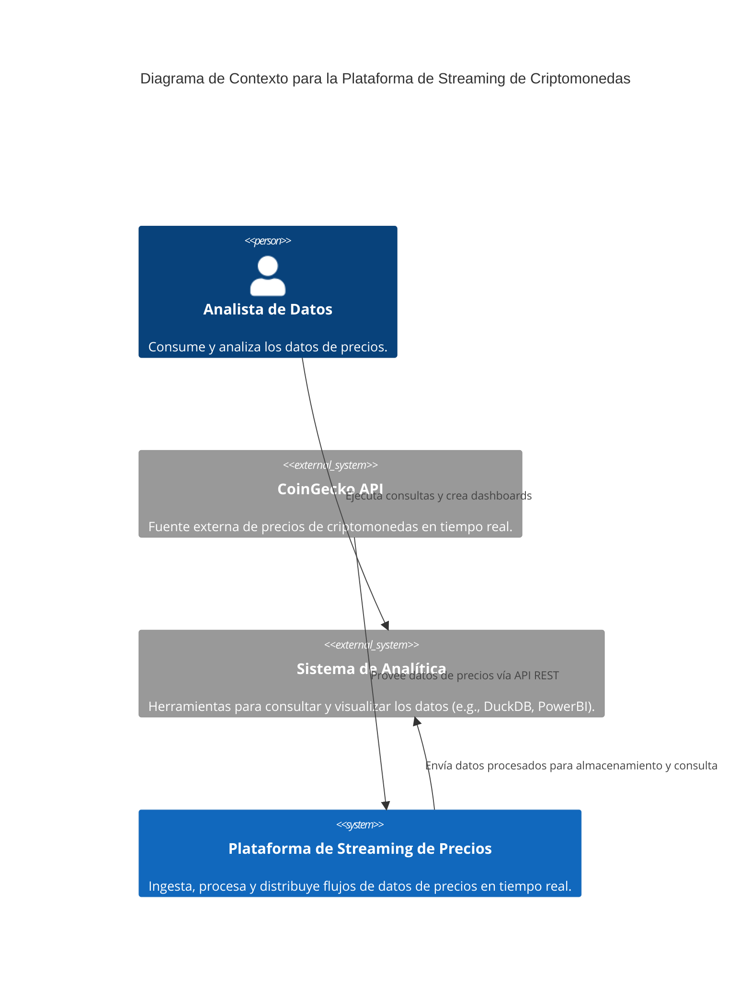
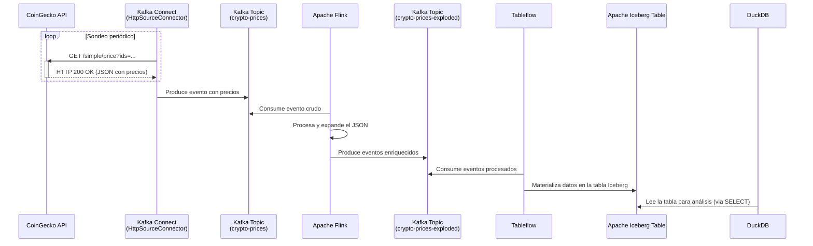

# Arquitectura del Taller de Streaming

Este documento describe la arquitectura del proyecto y el flujo de datos entre sus componentes.

## Diagrama de Contexto (C4)

El siguiente diagrama de contexto C4 muestra una vista de alto nivel del sistema, sus usuarios y las interacciones con sistemas externos.

## Diagrama de Secuencia del Dato

Este diagrama ilustra la secuencia de interacciones entre los componentes para mover los datos desde el origen hasta su destino final.

## Diagrama de Componentes

Este diagrama descompone la "Plataforma de Streaming" en sus principales componentes lógicos y muestra cómo interactúan entre sí y con los sistemas externos.

```mermaid
graph LR
    subgraph externals ["Sistemas Externos"]
        direction LR
        coingecko_api(CoinGecko API)
    end

    subgraph streaming_platform ["Plataforma de Streaming de Precios (Confluent Cloud)"]
        direction TB

        subgraph connect ["Ingesta"]
            direction LR
            kc[Kafka Connect<br>HttpSourceConnector]
        end

        subgraph broker ["Broker de Mensajes"]
            direction TB
            raw_topic(Tópico<br>crypto-prices)
            processed_topic(Tópico<br>crypto-prices-exploded)
        end

        subgraph processing ["Procesamiento de Streams"]
            direction LR
            flink[Apache Flink]
        end

        kc -- "produce en" --> raw_topic
        raw_topic -- "es consumido por" --> flink
        flink -- "produce en" --> processed_topic
    end

    subgraph analytics_layer ["Capa de Almacenamiento y Análisis"]
        direction TB
        tableflow[Tableflow]
        iceberg[Tabla<br>Apache Iceberg]
        duckdb[Motor de Consulta<br>DuckDB]

        tableflow -- "materializa en" --> iceberg
        iceberg -- "es leída por" --> duckdb
    end

    coingecko_api -- "1. Sondeo vía API REST" --> kc
    processed_topic -- "2. Consume stream de eventos" --> tableflow

    style kc fill:#cce5ff,stroke:#333,stroke-width:2px
    style flink fill:#cce5ff,stroke:#333,stroke-width:2px
    style tableflow fill:#cce5ff,stroke:#333,stroke-width:2px
    style duckdb fill:#cce5ff,stroke:#333,stroke-width:2px
    style raw_topic fill:#ffebcc,stroke:#333,stroke-width:2px
    style processed_topic fill:#ffebcc,stroke:#333,stroke-width:2px
    style iceberg fill:#d4edda,stroke:#333,stroke-width:2px
```

### Descripción de Componentes

1.  **API de CoinGecko**: Es la fuente de datos externa que provee información sobre los precios de las criptomonedas en formato JSON.
2.  **Kafka Connect**: Utiliza un `HttpSourceConnector` para sondear periódicamente la API de CoinGecko y enviar los datos obtenidos a un tópico de Kafka.
3.  **Tópico de Kafka (`crypto-prices`)**: Actúa como el punto de entrada para los datos crudos en la plataforma de streaming.
4.  **Apache Flink**: Lee los datos del tópico de Kafka, ejecuta trabajos de procesamiento en tiempo real (SQL) para transformar, limpiar o enriquecer los datos.
5.  **Tópico de Kafka (`crypto-prices-exploded`)**: Almacena los datos ya procesados y listos para ser consumidos por la siguiente capa.
6.  **Tableflow**: Un servicio que convierte automáticamente los datos de un tópico de Kafka en una tabla Apache Iceberg, optimizada para análisis.
7.  **Tabla Apache Iceberg**: El formato de tabla abierta donde se almacenan los datos procesados, listos para ser consultados por motores de análisis.
8.  **DuckDB**: Una base de datos analítica embebida que se utiliza para ejecutar consultas SQL directamente sobre las tablas Iceberg.
