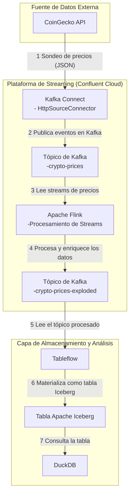

# Arquitectura del Taller de Streaming

Este documento describe la arquitectura del proyecto y el flujo de datos entre sus componentes.

## Diagrama de Flujo de Datos

El siguiente diagrama ilustra cómo los datos de precios de criptomonedas fluyen desde el origen (API de CoinGecko) hasta la capa de análisis (DuckDB).

### Descripción de Componentes

1.  **API de CoinGecko**: Es la fuente de datos externa que provee información sobre los precios de las criptomonedas en formato JSON.
2.  **Kafka Connect**: Utiliza un `HttpSourceConnector` para sondear periódicamente la API de CoinGecko y enviar los datos obtenidos a un tópico de Kafka.
3.  **Tópico de Kafka (`crypto-prices`)**: Actúa como el punto de entrada para los datos crudos en la plataforma de streaming.
4.  **Apache Flink**: Lee los datos del tópico de Kafka, ejecuta trabajos de procesamiento en tiempo real (SQL) para transformar, limpiar o enriquecer los datos.
5.  **Tópico de Kafka (`crypto-prices-exploded`)**: Almacena los datos ya procesados y listos para ser consumidos por la siguiente capa.
6.  **Tableflow**: Un servicio que convierte automáticamente los datos de un tópico de Kafka en una tabla Apache Iceberg, optimizada para análisis.
7.  **Tabla Apache Iceberg**: El formato de tabla abierta donde se almacenan los datos procesados, listos para ser consultados por motores de análisis.
8.  **DuckDB**: Una base de datos analítica embebida que se utiliza para ejecutar consultas SQL directamente sobre las tablas Iceberg.
